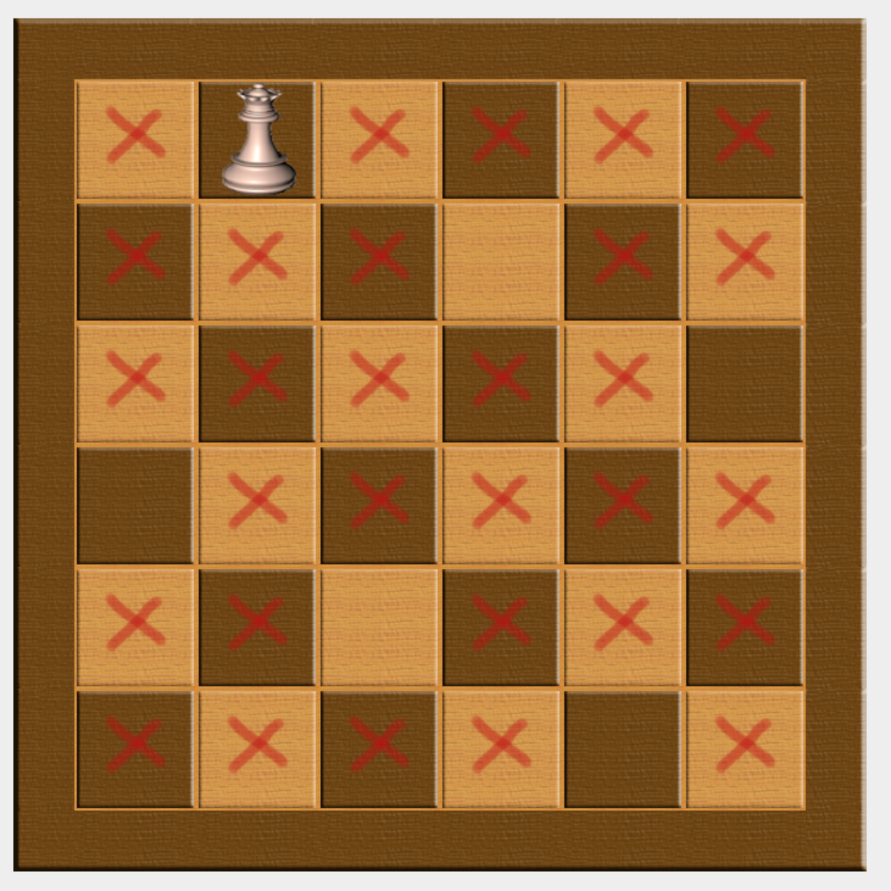

8 Queens Problem
================

Stored codes are java implementation of 8-queens problem's solution using Binary Decision Trees.
It is a system which allows to cross out all possibilities which don't lead to a solution of N-queens problem. 
http://en.wikipedia.org/wiki/Eight_queens_puzzle

This project was developed in IT university of Copenhangen Denmark for Intelligent systems programming.

Instructions
===============

In order to run -> run main method in ShowBoard class. 
If you want to define a size of a board, you can do it in ShowBoard.java file.
